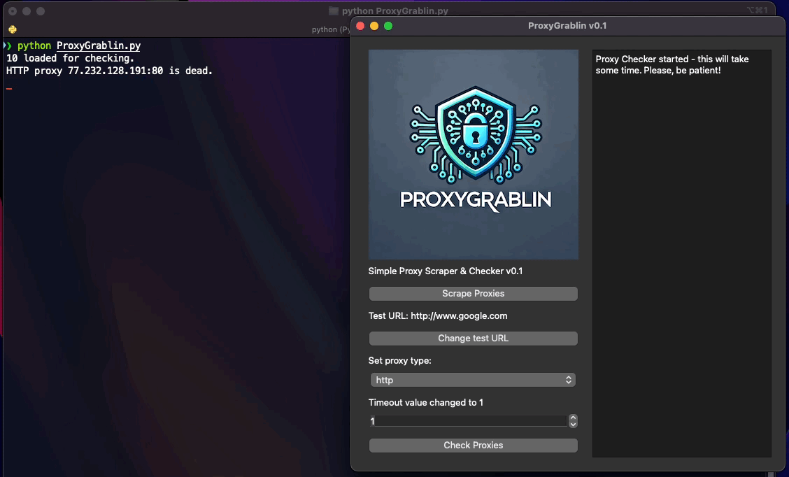

# ProxyGrablin  
*A simple proxy scraper and proxy checker with a GUI written in Python.*  
 
 
 
## Overview  
Scrape potential proxy IPs from websites and check the results for working proxies.  
ProxyGrablin is a simple proxy checker and scraper for Python 3.12+.  
The GUI provides the basic settings and is used to show the results of every task.  

Please note, that ProxyGrablin is in a early state of development.
You can support this project for faster development.
  
## Support  
Support this project with a little donation or tip a coffee:  
 - BTC: 16KLyV8C1S9NGkPeaPTGZxahvh1uw9aQCv
 - LTC: LboqWKdYjmVGu44kWkSSFTadVmzSu4B3sE

Every donation and tip helps!
  
## Requirements  
 - Python 3.12+
 - requests and PyQt5 modules installed.

If Python is already installed, you can use this command in console for installing the requirements:

    pip install -r requirements.txt
  
## Step by Step Guide
First create a text file and paste any URLs of websites which contain proxy IPs to it. Then start ProxyGrablin with:

    python ProxyGrablin.py

Click on "Scrape Proxies" and you will be asked to choose a text file. Choose the text file with the URLs here. Now the scraper will start to check the websites for any proxy IPS. Once finished you are asked to save the results. Just enter any filename, e.g. "scraped".

The proxy checker will use Google to check the proxies. If you want to change the website used by the checker, just click on "Change test URL" and enter another one. Select the proxy type to check for and change the timeout value if you want.

Now you can click on "Check Proxies". Then choose the text file you saved the proxy IPs to and wait. You can follow the checker process in the console. Once the checker has finished and in case it found any working proxy, you will be asked for the file into which the working proxies shall be saved. The working proxies will also be displayed in the output area of the GUI.

## Upcoming improvements

 - Threads for the proxy checker
 - GUI rework
 - Logs rework
 - other minor improvements

